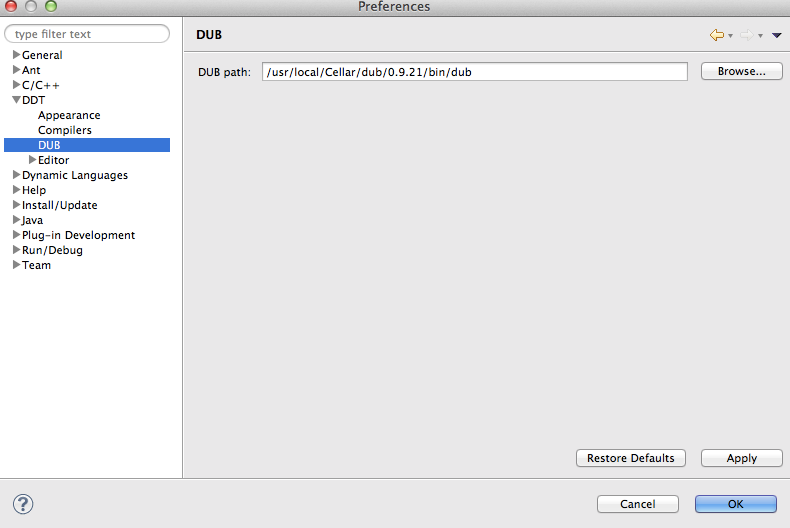

# D言語学習

## Requirements

- DMD v2.065.0
- DUB v0.9.21
- Eclipse Kepler
- DDT - D Development Tools

## Project Setup

1. DMDをインストールする。

    Macの場合は、
    
    `brew install dmd`
    
    このように、Homebrewでもインストールできるが、DDTのビルドが通らないので素直にdmgファイルをダウンロードしてインストールすることを勧める。
    
2. DUBをインストールする。

    `brew install dub`

3. Eclipseをインストールする。

4. DDTのプラグインをEclipseにインストールする。

     `https://code.google.com/p/ddt/`を参照のこと。

5. Eclipseにコンパイラを設定する。

    `Compiler system Library`に、`druntime`と`phobos`のソースを追加しないと、Ecilpseの`Content Assist`がうまく動かない。
    
    

6. EclipseにDUBのパスを設定する。

    

7. プロジェクトをインポートする。

    Dubプロジェクトは、Importにないので、新規プロジェクトとして再作成する。
    
    

## Building

`dub build`

## Testing

### Unit Tests

`dub test`

## Debugging

Eclipse:
`Debug As > D Application`

## Running

Eclipse:
`Run As > D Application`

or

`dub run`

## Troubleshooting & Useful Tools

## Contributing changes

## License
